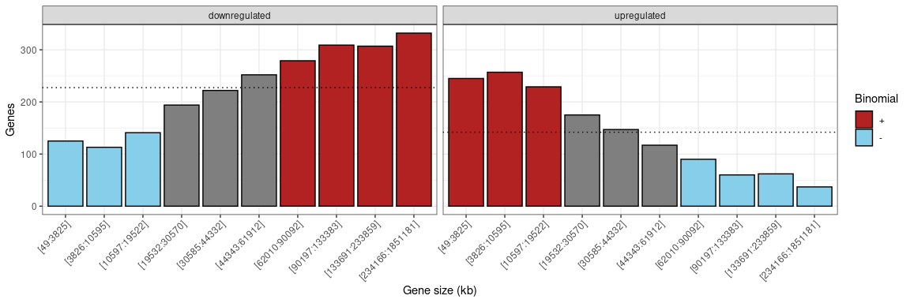
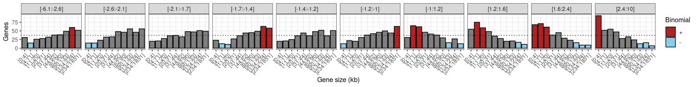
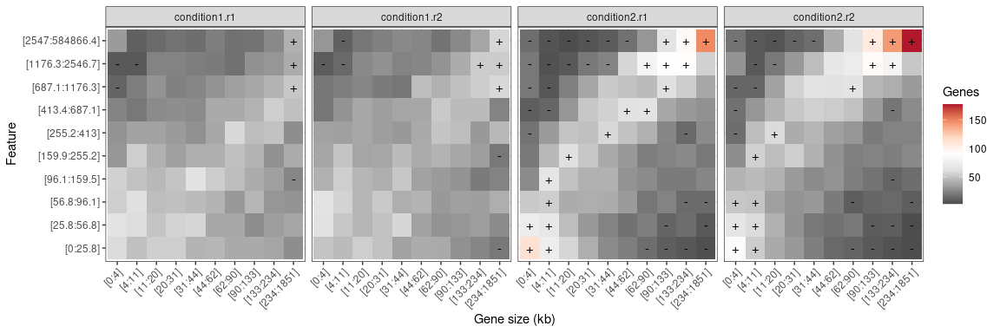
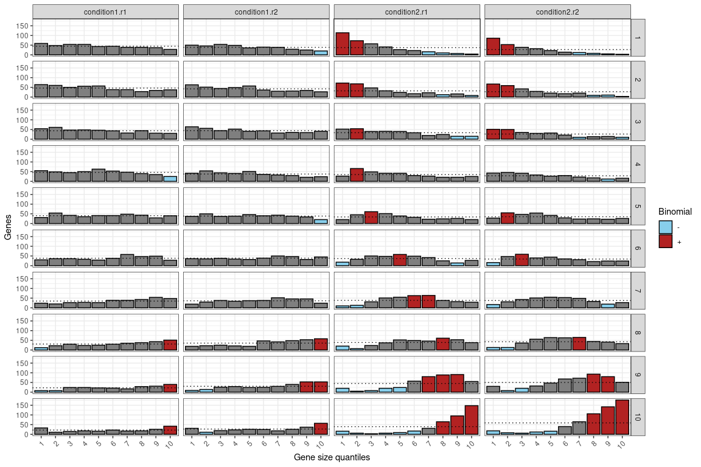
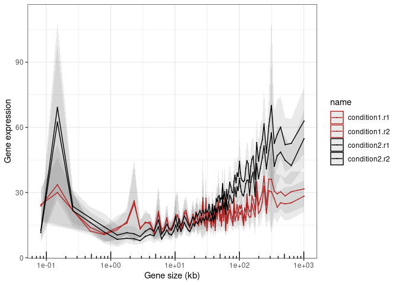
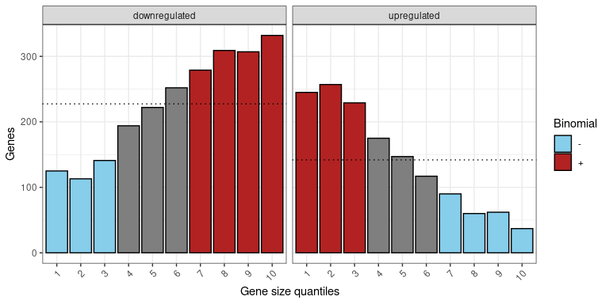

<!-- README.md is generated from README.Rmd. Please edit that file -->

# genesizeR </a>

<!-- badges: start -->

[](https://lifecycle.r-lib.org/articles/stages.html#experimental)
<!-- badges: end -->

## Overview

The goal of `genesizeR` is to provide a collection of computational
tools to analyze gene sizes within gene features (e.g. expression) and
gene sets (e.g. upregulated/downregulated).

If you use `genesizeR`, please cite our [paper]():

    genesizeR: an R package to incorporate gene size into categorical and quantitative investigations of gene sets
    MJ McCoy and AZ Fire
    XXX, Volume XX, Issue XX, Month 2024, DOI, URL

## Requirements

The `genesizeR` package works with R version \>= 3.6.3 and several
packages from `tidyverse`. Either `tidyverse` can be installed and
loaded, or these individual packages can be installed and loaded:

- `dplyr` version \>= 1.0.9
- `tidyr` version \>= 1.2.0
- `readr` version \>= 2.1.2
- `ggplot2` version \>= 3.3.6
- `Hmisc` version \>= 5.1.1

## Installation

You can install the development version of `genesizeR` from
[GitHub](https://github.com/) with:

``` r
# install.packages("devtools")
devtools::install_github("mjmccoy/genesizeR")
```

## Example usage

This is series of examples which shows how to perform gene size
enrichment analysis with either quantitative or categorical variables.
The example data was modified from the following paper:

    Heat shock induces premature transcript termination and reconfigures the human transcriptome.
    S Cugusi, M Richard, K Gavin, J Walker, Z Han, P Pisano, M Wierer, A Stewart, and J Svejstrup
    Molecular Cell 82, 1573-1588.e10 (2022), DOI: 10.1016/j.molcel.2022.01.007

### Load libraries

``` r
library(dplyr)
library(tidyr)
library(readr)
library(Hmisc)
library(ggplot2)
library(genesizeR)
```

### Load user-specified gene coordinates

Gene coordinates can be extracted from an annotation file (e.g. gtf,
gff) or downloaded from
[Ensembl](https://www.ensembl.org/biomart/martview). Here we use gene
coordinates from Homo sapiens GRCh38.p14 Ensembl release 110. These
should be in the format chromosome (e.g. Chromosome/scaffold name),
chromosome start position \[e.g. Gene start (bp)\], chromosome end
position \[e.g. Gene end (bp)\], and gene_id (e.g. Gene stable ID), in
this specific order.

``` r
# Load user-provided gene coordinates and specify name of gene_id in the gene coordinates file (in this example: Gene stable ID)
lengths.df <- genesizeR_gene_lengths(
  filepath = "inst/extdata/hsap_GRCh38.p14_ensembl_release_110_gene_lengths.txt",
  gene_id = "Gene stable ID",
  delim = "\t")

head(lengths.df)
#> # A tibble: 6 × 2
#>   gene_id         length
#>   <chr>            <dbl>
#> 1 ENSG00000210049     71
#> 2 ENSG00000211459    954
#> 3 ENSG00000210077     69
#> 4 ENSG00000210082   1559
#> 5 ENSG00000209082     75
#> 6 ENSG00000198888    956
```

### Estimate gene size enrichment for quantitative variables

#### Load quantitative data

``` r
data.df <- genesizeR_input(
  file = "inst/extdata/example_expression_data.tsv",
  gene_id = "gene_id",
  delim = "\t")

head(data.df)
#> # A tibble: 6 × 15
#>   condition1.r1 condition1.r2 condition2.r1 condition2.r2 baseMean log2FC lfcSE
#>           <dbl>         <dbl>         <dbl>         <dbl>    <dbl>  <dbl> <dbl>
#> 1          5.71          3.64         35.9          40.3      15.8  -2.62 0.729
#> 2       1617.         1326.         6319.         4504.     8804.   -1.49 0.269
#> 3        302.          313.            5.98          2.07     61.4   6.67 0.712
#> 4        302.          315.            5.98          2.07     61.5   6.67 0.712
#> 5       2597.         2867.            6.98          8.27    490.    8.94 0.502
#> 6       2597.         2867.            6.98          8.27    490.    8.94 0.502
#> # ℹ 8 more variables: stat <dbl>, pvalue <dbl>, FDR <dbl>, gene_id <chr>,
#> #   gene_name <chr>, gene_biotype <chr>, gene.width <dbl>, GRCh38 <chr>
```

#### Append gene lengths

``` r
data.df <- genesizeR_add_lengths(data.df, lengths.df)

head(data.df)
#> # A tibble: 6 × 16
#>   condition1.r1 condition1.r2 condition2.r1 condition2.r2 baseMean log2FC lfcSE
#>           <dbl>         <dbl>         <dbl>         <dbl>    <dbl>  <dbl> <dbl>
#> 1          5.71          3.64         35.9          40.3      15.8  -2.62 0.729
#> 2       1617.         1326.         6319.         4504.     8804.   -1.49 0.269
#> 3        302.          313.            5.98          2.07     61.4   6.67 0.712
#> 4        302.          315.            5.98          2.07     61.5   6.67 0.712
#> 5       2597.         2867.            6.98          8.27    490.    8.94 0.502
#> 6       2597.         2867.            6.98          8.27    490.    8.94 0.502
#> # ℹ 9 more variables: stat <dbl>, pvalue <dbl>, FDR <dbl>, gene_id <chr>,
#> #   gene_name <chr>, gene_biotype <chr>, gene.width <dbl>, GRCh38 <chr>,
#> #   length <dbl>
```

#### Perform binomial test for gene size enrichment/depletion

``` r
binomial.df <- genesizeR_binomial_test(data.df, feature_name = "log2FC")

head(binomial.df)
#> # A tibble: 6 × 7
#>   length_range feature_range     n total_trials      p_val     p_adj sign 
#>   <ord>        <ord>         <int>        <int>      <dbl>     <dbl> <chr>
#> 1 [0:4]        [-6.1:-2.6]      31          370 0.340      0.420     ""   
#> 2 [0:4]        [-2.6:-2.1]      15          370 0.0000390  0.000205  "-"  
#> 3 [0:4]        [-2.1:-1.7]      20          370 0.00229    0.00673   ""   
#> 4 [0:4]        [-1.7:-1.4]      23          369 0.0147     0.0323    ""   
#> 5 [0:4]        [-1.4:-1.2]      20          369 0.00227    0.00673   ""   
#> 6 [0:4]        [-1.2:-1]        13          369 0.00000498 0.0000383 "-"
```

#### genesizeR tile plot

``` r
genesizeR_plot(binomial.df, type = "tile", quantiles = FALSE)
```



#### genesizeR bar plot

``` r
genesizeR_plot(binomial.df, type = "bar")
```



### Estimate gene size enrichment for quantitative variables by sample

#### Load quantitative data

genesizeR can also work with quantitative data with multiple samples.
The input data must contain only the gene_id (e.g. “Gene stable ID”),
and then columns with numerical data for each sample
(e.g. condition1.r1, condition1.r2, condition2.r1, condition2.r2, etc.).

``` r
data.df <- genesizeR_input(
  file = "inst/extdata/example_expression_by_sample_data.tsv",
  gene_id = "Gene stable ID",
  delim = "\t")

head(data.df)
#> # A tibble: 6 × 5
#>   condition1.r1 condition1.r2 condition2.r1 condition2.r2 gene_id        
#>           <dbl>         <dbl>         <dbl>         <dbl> <chr>          
#> 1          5.71          3.64         35.9          40.3  ENSG00000260917
#> 2       1617.         1326.         6319.         4504.   ENSG00000264462
#> 3        302.          313.            5.98          2.07 ENSG00000274060
#> 4        302.          315.            5.98          2.07 ENSG00000275692
#> 5       2597.         2867.            6.98          8.27 ENSG00000273937
#> 6       2597.         2867.            6.98          8.27 ENSG00000276312
```

#### Append gene lengths

``` r
data.df <- genesizeR_add_lengths(data.df, lengths.df)

head(data.df)
#> # A tibble: 6 × 6
#>   condition1.r1 condition1.r2 condition2.r1 condition2.r2 gene_id         length
#>           <dbl>         <dbl>         <dbl>         <dbl> <chr>            <dbl>
#> 1          5.71          3.64         35.9          40.3  ENSG00000260917   4237
#> 2       1617.         1326.         6319.         4504.   ENSG00000264462    180
#> 3        302.          313.            5.98          2.07 ENSG00000274060     92
#> 4        302.          315.            5.98          2.07 ENSG00000275692     92
#> 5       2597.         2867.            6.98          8.27 ENSG00000273937     90
#> 6       2597.         2867.            6.98          8.27 ENSG00000276312     90
```

#### Perform binomial test for gene size enrichment/depletion

``` r
# Binomial test
binomial.df <- genesizeR_binomial_test(data.df, by_sample = T)

head(binomial.df)
#> # A tibble: 6 × 8
#>   name        length_range feature_range     n total_trials   p_val  p_adj sign 
#>   <chr>       <ord>        <ord>         <int>        <int>   <dbl>  <dbl> <chr>
#> 1 condition1… [0:4]        [0:25.8]         59          445 0.0266  0.0657 ""   
#> 2 condition1… [0:4]        [25.8:56.8]      64          462 0.00817 0.0248 ""   
#> 3 condition1… [0:4]        [56.8:96.1]      54          436 0.110   0.195  ""   
#> 4 condition1… [0:4]        [96.1:159.5]     55          462 0.187   0.291  ""   
#> 5 condition1… [0:4]        [159.9:255.2]    31          404 0.135   0.229  ""   
#> 6 condition1… [0:4]        [255.2:413]      30          384 0.173   0.279  ""
```

#### Plot genesizeR tile plot

``` r
genesizeR_plot(binomial.df, by_sample = T, type = "tile")
```



#### Plot genesizeR bar plot

``` r
genesizeR_plot(binomial.df, by_sample = T, type = "bar")
```



#### Plot genesizeR line plot

``` r
genesizeR_plot(data.df, type = "line", quantiles = FALSE) +
  scale_color_manual(values = c("condition1.r1" = "firebrick", "condition1.r2" = "firebrick", "condition2.r1" = "black", "condition2.r2" = "black"))
```



### Estimate gene size enrichment for categorical variables

#### Load gene set data

``` r
# Load gene set data
data.df <- genesizeR_input(
  file = "inst/extdata/example_gene_set_data.tsv",
  gene_id = "Gene stable ID",
  delim = "\t")

head(data.df)
#> # A tibble: 6 × 2
#>   gene_id         group        
#>   <chr>           <chr>        
#> 1 ENSG00000260917 downregulated
#> 2 ENSG00000264462 downregulated
#> 3 ENSG00000274060 upregulated  
#> 4 ENSG00000275692 upregulated  
#> 5 ENSG00000273937 upregulated  
#> 6 ENSG00000276312 upregulated
```

#### Append gene lengths

``` r
data.df <- genesizeR_add_lengths(data.df, lengths.df)

head(data.df)
#> # A tibble: 6 × 3
#>   gene_id         group         length
#>   <chr>           <chr>          <dbl>
#> 1 ENSG00000260917 downregulated   4237
#> 2 ENSG00000264462 downregulated    180
#> 3 ENSG00000274060 upregulated       92
#> 4 ENSG00000275692 upregulated       92
#> 5 ENSG00000273937 upregulated       90
#> 6 ENSG00000276312 upregulated       90
```

#### Perform binomial test for gene size enrichment/depletion

``` r
binomial.df <- genesizeR_binomial_test(data.df, categorical = T)

head(binomial.df)
#> # A tibble: 6 × 7
#>   length_range group             n total_trials    p_val    p_adj sign 
#>   <ord>        <chr>         <int>        <int>    <dbl>    <dbl> <chr>
#> 1 [0:4]        downregulated   125         2274 1.13e-14 3.22e-14 -    
#> 2 [0:4]        upregulated     245         1419 6.57e-17 3.28e-16 +    
#> 3 [4:11]       downregulated   113         2274 2.71e-18 1.81e-17 -    
#> 4 [4:11]       upregulated     257         1419 1.88e-20 1.88e-19 +    
#> 5 [11:20]      downregulated   141         2274 1.41e-10 2.81e-10 -    
#> 6 [11:20]      upregulated     229         1419 7.53e-13 1.88e-12 +
```

#### Plot genesizeR tile plot

``` r
genesizeR_plot(binomial.df, categorical = T, type = "tile")
```


#### Plot genesizeR bar plot

``` r
genesizeR_plot(binomial.df, categorical = T, type = "bar")
```



# Contact

If you have any comments or suggestions please raise an issue or contact
us:  
Matthew McCoy: <mjmccoy@stanford.edu>
