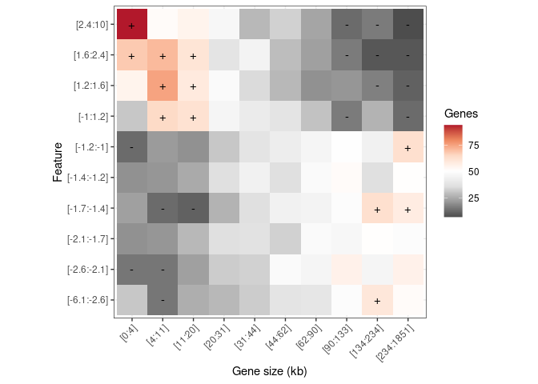
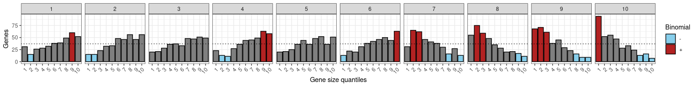
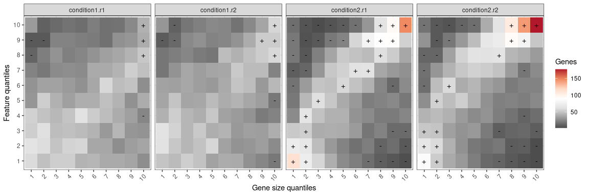
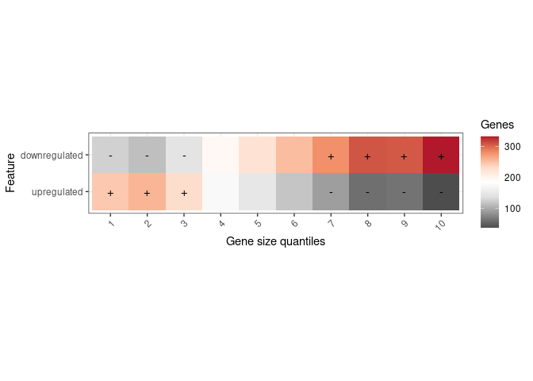

<!-- README.md is generated from README.Rmd. Please edit that file -->

# sizeR </a>

<!-- badges: start -->

[](https://lifecycle.r-lib.org/articles/stages.html#experimental)
<!-- badges: end -->

## Overview

The goal of `sizeR` is to provide a collection of computational tools to
analyze gene sizes within gene features (e.g. expression) and gene sets
(e.g. upregulated/downregulated).

If you use `sizeR` please cite our [paper]()

    sizeR: an R package for the analysis of gene size within gene features and gene sets
    Matthew J McCoy, Andrew Z Fire
    XXX, Volume XX, Issue XX, Month 2024, DOI, URL

## Requirements

The `sizeR` package works with R version \>= 3.6.3 and several packages
from `tidyverse`. Either `tidyverse` can be installed and loaded, or
these individual packages can be installed and loaded:

-   `dplyr` version \>= 1.0.9
-   `tidyr` version \>= 1.2.0
-   `readr` version \>= 2.1.2
-   `ggplot2` version \>= 3.3.6

## Installation

You can install the development version of `sizeR` from
[GitHub](https://github.com/) with:

``` r
# install.packages("devtools")
devtools::install_github("mjmccoy/sizeR")
```

## Example usage

This is series of examples which shows how to perform gene size
enrichment analysis with either quantitative or categorical variables:

### Load libraries

``` r
library(dplyr)
library(tidyr)
library(readr)
library(ggplot2)
library(sizeR)
```

### Load user-specified gene coordinates

Gene coordinates can be extracted from an annotation file (e.g. gtf,
gff) or downloaded from
[Ensembl](https://www.ensembl.org/biomart/martview). Here we use gene
coordinates from Homo sapiens GRCh38.p14 Ensembl release 110. These
should be in the format chromosome (e.g. Chromosome/scaffold name),
chromosome start position \[e.g. Gene start (bp)\], chromosome end
position \[e.g. Gene end (bp)\], and gene_id (e.g. Gene stable ID), in
this specific order.

``` r
# Load user_specified gene lengths
lengths.df <- gene_lengths(filepath = "inst/extdata/hsap_GRCh38.p14_ensembl_release_110_gene_lengths.txt")

head(lengths.df)
#> # A tibble: 6 × 7
#>   `Chromosome/scaffold name` `Gene start (bp)` `Gene end (bp)` `Gene stable ID`
#>   <chr>                                  <dbl>           <dbl> <chr>           
#> 1 MT                                       577             647 ENSG00000210049 
#> 2 MT                                       648            1601 ENSG00000211459 
#> 3 MT                                      1602            1670 ENSG00000210077 
#> 4 MT                                      1671            3229 ENSG00000210082 
#> 5 MT                                      3230            3304 ENSG00000209082 
#> 6 MT                                      3307            4262 ENSG00000198888 
#> # … with 3 more variables: `Gene stable ID version` <chr>, `Gene name` <chr>,
#> #   length <dbl>
```

### Estimate gene size enrichment for quantitative variables

#### Load quantitative data

``` r
data.df <- read_csv(file = "inst/extdata/example_expression_data.csv")

head(data.df)
#> # A tibble: 6 × 15
#>   condition1.r1 condition1.r2 condition2.r1 condition2.r2 baseMean log2FC lfcSE
#>           <dbl>         <dbl>         <dbl>         <dbl>    <dbl>  <dbl> <dbl>
#> 1          5.71          3.64         35.9          40.3      15.8  -2.62 0.729
#> 2       1617.         1326.         6319.         4504.     8804.   -1.49 0.269
#> 3        302.          313.            5.98          2.07     61.4   6.67 0.712
#> 4        302.          315.            5.98          2.07     61.5   6.67 0.712
#> 5       2597.         2867.            6.98          8.27    490.    8.94 0.502
#> 6       2597.         2867.            6.98          8.27    490.    8.94 0.502
#> # … with 8 more variables: stat <dbl>, pvalue <dbl>, FDR <dbl>, gene_id <chr>,
#> #   gene_name <chr>, gene_biotype <chr>, gene.width <dbl>, GRCh38 <chr>
```

#### Append gene lengths

``` r
data.df <- add_lengths(data.df, lengths.df)

head(data.df)
#> # A tibble: 6 × 16
#>   condition1.r1 condition1.r2 condition2.r1 condition2.r2 baseMean log2FC lfcSE
#>           <dbl>         <dbl>         <dbl>         <dbl>    <dbl>  <dbl> <dbl>
#> 1          5.71          3.64         35.9          40.3      15.8  -2.62 0.729
#> 2       1617.         1326.         6319.         4504.     8804.   -1.49 0.269
#> 3        302.          313.            5.98          2.07     61.4   6.67 0.712
#> 4        302.          315.            5.98          2.07     61.5   6.67 0.712
#> 5       2597.         2867.            6.98          8.27    490.    8.94 0.502
#> 6       2597.         2867.            6.98          8.27    490.    8.94 0.502
#> # … with 9 more variables: stat <dbl>, pvalue <dbl>, FDR <dbl>, gene_id <chr>,
#> #   gene_name <chr>, gene_biotype <chr>, gene.width <dbl>, GRCh38 <chr>,
#> #   length <dbl>
```

#### Perform binomial test for gene size enrichment/depletion

``` r
binomial.df <- binomial_test(data.df, feature_name = "log2FC")
```

#### sizeR tile plot

``` r
binomial_tile_plot(binomial.df)
```



#### sizeR bar plot

``` r
binomial_bar_plot(binomial.df)
```



### Estimate gene size enrichment for quantitative variables by sample

#### Load quantitative data

``` r
data.df <- read_csv(file = "inst/extdata/example_expression_by_sample_data.csv")

head(data.df)
#> # A tibble: 6 × 5
#>   condition1.r1 condition1.r2 condition2.r1 condition2.r2 gene_id        
#>           <dbl>         <dbl>         <dbl>         <dbl> <chr>          
#> 1          5.71          3.64         35.9          40.3  ENSG00000260917
#> 2       1617.         1326.         6319.         4504.   ENSG00000264462
#> 3        302.          313.            5.98          2.07 ENSG00000274060
#> 4        302.          315.            5.98          2.07 ENSG00000275692
#> 5       2597.         2867.            6.98          8.27 ENSG00000273937
#> 6       2597.         2867.            6.98          8.27 ENSG00000276312
```

#### Append gene lengths

``` r
data.df <- add_lengths(data.df, lengths.df)

head(data.df)
#> # A tibble: 6 × 6
#>   condition1.r1 condition1.r2 condition2.r1 condition2.r2 gene_id         length
#>           <dbl>         <dbl>         <dbl>         <dbl> <chr>            <dbl>
#> 1          5.71          3.64         35.9          40.3  ENSG00000260917   4237
#> 2       1617.         1326.         6319.         4504.   ENSG00000264462    180
#> 3        302.          313.            5.98          2.07 ENSG00000274060     92
#> 4        302.          315.            5.98          2.07 ENSG00000275692     92
#> 5       2597.         2867.            6.98          8.27 ENSG00000273937     90
#> 6       2597.         2867.            6.98          8.27 ENSG00000276312     90
```

#### Perform binomial test for gene size enrichment/depletion

``` r
# Binomial test
binomial.df <- binomial_test(data.df, by_sample = T)

head(binomial.df)
#> # A tibble: 6 × 8
#>   name        length_range feature_range     n total_trials   p_val  p_adj sign 
#>   <chr>       <ord>        <ord>         <int>        <int>   <dbl>  <dbl> <chr>
#> 1 condition1… [0:4]        [0:25.8]         59          445 0.0266  0.0657 ""   
#> 2 condition1… [0:4]        [25.8:56.8]      64          462 0.00817 0.0248 ""   
#> 3 condition1… [0:4]        [56.8:96.1]      54          436 0.110   0.195  ""   
#> 4 condition1… [0:4]        [96.1:159.5]     55          462 0.187   0.291  ""   
#> 5 condition1… [0:4]        [159.9:255.2]    31          404 0.135   0.229  ""   
#> 6 condition1… [0:4]        [255.2:413]      30          384 0.173   0.279  ""
```

#### Plot sizeR tile plot

``` r
binomial_tile_plot(binomial.df, by_sample = T)
```



#### Plot sizeR bar plot

``` r
binomial_bar_plot(binomial.df, by_sample = T)
```


#### Plot sizeR line plot

``` r
sizeR_line_plot(data.df) +
  scale_color_manual(values = c("condition1.r1" = "firebrick", "condition1.r2" = "firebrick", "condition2.r1" = "black", "condition2.r2" = "black"))
```


### Estimate gene size enrichment for categorical variables

#### Load gene set data

``` r
# Load gene set data
data.df <- read_csv(file = "inst/extdata/example_gene_set_data.csv")

head(data.df)
#> # A tibble: 6 × 2
#>   gene_id         group        
#>   <chr>           <chr>        
#> 1 ENSG00000260917 downregulated
#> 2 ENSG00000264462 downregulated
#> 3 ENSG00000274060 upregulated  
#> 4 ENSG00000275692 upregulated  
#> 5 ENSG00000273937 upregulated  
#> 6 ENSG00000276312 upregulated
```

#### Append gene lengths

``` r
data.df <- add_lengths(data.df, lengths.df)

head(data.df)
#> # A tibble: 6 × 3
#>   gene_id         group         length
#>   <chr>           <chr>          <dbl>
#> 1 ENSG00000260917 downregulated   4237
#> 2 ENSG00000264462 downregulated    180
#> 3 ENSG00000274060 upregulated       92
#> 4 ENSG00000275692 upregulated       92
#> 5 ENSG00000273937 upregulated       90
#> 6 ENSG00000276312 upregulated       90
```

#### Perform binomial test for gene size enrichment/depletion

``` r
binomial.df <- binomial_test(data.df, categorical = T)

head(binomial.df)
#> # A tibble: 6 × 7
#>   length_range group             n total_trials    p_val    p_adj sign 
#>   <ord>        <chr>         <int>        <int>    <dbl>    <dbl> <chr>
#> 1 [0:4]        downregulated   125         2274 1.13e-14 3.22e-14 -    
#> 2 [0:4]        upregulated     245         1419 6.57e-17 3.28e-16 +    
#> 3 [4:11]       downregulated   113         2274 2.71e-18 1.81e-17 -    
#> 4 [4:11]       upregulated     257         1419 1.88e-20 1.88e-19 +    
#> 5 [11:20]      downregulated   141         2274 1.41e-10 2.81e-10 -    
#> 6 [11:20]      upregulated     229         1419 7.53e-13 1.88e-12 +
```

#### Plot sizeR tile plot

``` r
binomial_tile_plot(binomial.df, categorical = T)
```



#### Plot sizeR bar plot

``` r
binomial_bar_plot(binomial.df, categorical = T)
```


# Contact

If you have any comments or suggestions please raise an issue or contact
us:  
Matthew McCoy: <mjmccoy@stanford.edu>  
Andrew Fire: <afire@stanford.edu>
